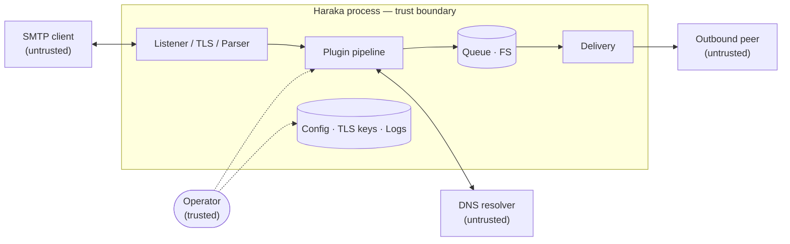

# Security Policy

## Supported Versions

Security fixes are applied to the **current release** only. We encourage all users to run the latest version.

| Version        | Supported |
| -------------- | --------- |
| 3.1.x (latest) | ✅        |
| < 3.1          | ❌        |

## Reporting a Vulnerability

**Please do not report security vulnerabilities through public GitHub issues.**

Use [GitHub Private Vulnerability Reporting](https://github.com/haraka/Haraka/security/advisories/new) to disclose security issues confidentially. This allows the maintainers to assess and patch the issue before public disclosure.

Include as much of the following as possible:

- A description of the vulnerability and its potential impact
- Steps to reproduce or a proof-of-concept
- Affected version(s)
- Any suggested mitigations or patches

## Response Process

1. **Acknowledgement** — We aim to acknowledge reports within **72 hours**.
2. **Assessment** — We will confirm the issue, determine severity, and identify affected versions.
3. **Fix & Release** — A patch release will be prepared and coordinated with the reporter.
4. **Disclosure** — A GitHub Security Advisory (and CVE if applicable) will be published after the fix is available.

We follow [coordinated vulnerability disclosure](https://vuls.cert.org/confluence/display/CVD). Reporters are credited in the advisory unless they prefer otherwise.

## Security Advisories

Published advisories are listed at:
**https://github.com/haraka/Haraka/security/advisories**

## Threat Model

Haraka is an SMTP server and plugin host. It accepts inbound network
connections, parses SMTP commands and message content, and can deliver mail
outbound when an operator enables relaying or outbound.

This threat model assumes the operator controls the host, configuration,
enabled plugins, credentials, TLS material, and any external services Haraka
is configured to use.

### Data flow

The trust boundary is the Haraka process. External peers (SMTP clients, DNS
resolvers, outbound peers) are untrusted; data crossing the boundary inbound
must be validated before it affects delivery, state, or process behavior.
Inside the boundary, plugins, the queue, configuration, TLS material, and
logs share the Haraka process privilege and are the operator's
responsibility — they are not a security boundary against each other.

### Assets

The assets Haraka aims to protect:

- **Message content** in transit and queued on disk
- **AUTH credentials** received via SMTP AUTH, and any upstream credentials
  Haraka holds for outbound or backend services
- **TLS private keys** and certificates used by the listener and for
  outbound delivery
- **Queue integrity** — no injection, alteration, or deletion of queued
  messages from outside the trust boundary
- **Availability** of the SMTP service to legitimate clients
- **Sender reputation** of the operator's deployment — Haraka must not be
  abusable as an open relay or spam amplifier under documented
  configuration

### Entry points and actors

Untrusted data enters Haraka through:

- **SMTP listeners** on the operator-configured ports (typically 25, 465,
  587, and any additional listeners enabled by plugins or configuration)
- **PROXY protocol or XCLIENT metadata** when the operator has enabled
  trusted-relay forwarding
- **DNS responses** to lookups performed by Haraka core or plugins
  (rDNS, SPF, DKIM, MX, DNSBL, etc.)
- **Outbound SMTP responses** received from peers during delivery

Haraka distinguishes these actors:

- **Anonymous SMTP client** — connecting from the network without
  authentication; trusted only to issue SMTP commands subject to policy
- **Authenticated submission user** — passed SMTP AUTH; trusted with the
  envelope and policy the operator's auth backend permits, nothing more
- **Trusted relay peer** — a network source the operator has configured to
  bypass certain checks (e.g. permitted to relay, or whose PROXY/XCLIENT
  metadata is honored)
- **Operator** — controls the host, configuration, and installed plugins;
  fully trusted
- **Plugin code** — runs inside the trust boundary with full process
  privilege; treated as trusted-as-installed, and not a security boundary

### Haraka does not trust

- SMTP clients and other remote peers, including commands, envelopes, headers,
  bodies, attachments, authentication attempts, HELO/EHLO names, and proxied
  client metadata before validation
- Data returned by remote services Haraka communicates with, such as DNS
  lookups and outbound SMTP peers
- Untrusted remote input must not be able to trigger behavior beyond
  documented SMTP and plugin semantics, such as unauthorized relaying,
  unintended command execution, protected-data disclosure, or service
  unavailability

### Haraka trusts

- The operating system, filesystem, Node.js runtime, local network, process
  privileges, and local administrators operating the service
- Haraka configuration and deployment choices, including listener exposure,
  relay and authentication policy, TLS certificates, proxy settings, and
  enabled plugins
- Code loaded as plugins or dependencies. Plugins run with Haraka's process
  privileges and are not a security boundary
- Upstream services and dependencies as separate projects; flaws in those
  components are usually reported upstream unless Haraka's integration creates
  a distinct vulnerability

### STRIDE summary

In-scope threats are classified using [STRIDE][stride] applied at the
Haraka trust boundary shown above. A finding that lets a remote peer
cause any of the following under documented or default-safe configuration
is generally a vulnerability.

| Category | Example threats at the Haraka boundary |
| --- | --- |
| **S**poofing | Forged HELO/EHLO or AUTH, identity bypass, unvalidated XCLIENT or proxy metadata accepted as authoritative |
| **T**ampering | SMTP smuggling, CRLF or header injection, parser inconsistencies that change how a message is delivered or interpreted |
| **R**epudiation | Remote input that erases or forges the Received: trail, or otherwise defeats logging under default configuration |
| **I**nformation disclosure | Leakage of message content, credentials, or internal state through SMTP responses, DSNs, error messages, or logs |
| **D**enial of service | Deterministic resource exhaustion or crashes triggered by remote input without operator misconfiguration |
| **E**levation of privilege | Remote code execution, or escape of documented SMTP/plugin semantics into arbitrary behavior inside the Haraka process |

Plugins execute inside the trust boundary by design, so a malicious or
vulnerable plugin can produce any STRIDE category above. Findings that
require installing such a plugin are not vulnerabilities in Haraka itself.

[stride]: https://en.wikipedia.org/wiki/STRIDE_model

## Scope

Issues that require control of a trusted element are out of scope, including:

- Vulnerabilities requiring control of the host OS, filesystem, Node.js
  runtime, local administrator account, or other trusted infrastructure
- Malicious or compromised plugins or dependencies intentionally installed or
  enabled by the operator
- Pure misconfiguration of listeners, relay policy, TLS, proxying, or
  outbound destinations unless Haraka's documented defaults create the
  insecure state

Issues in third-party plugins maintained outside this repository should be reported to their respective maintainers.
